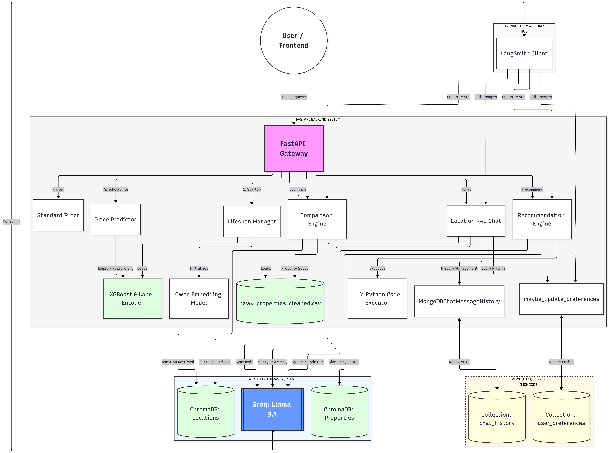
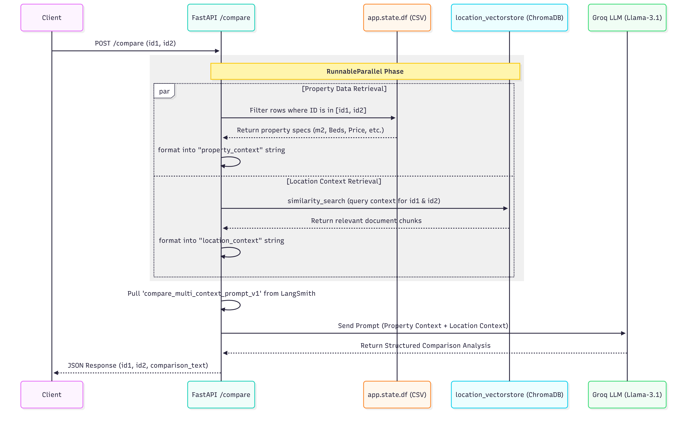
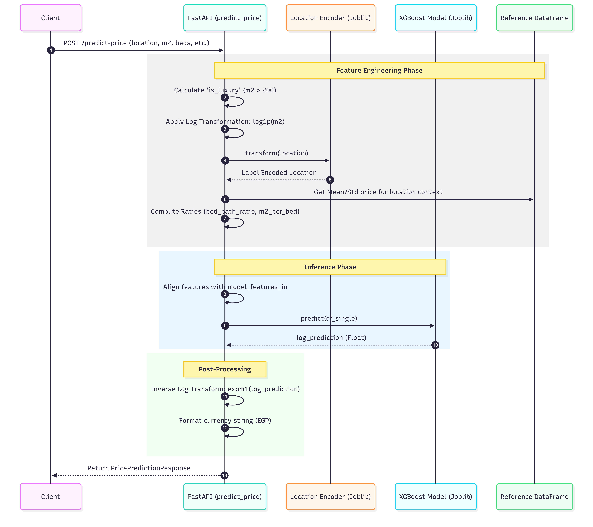

# Nawy Property Recommender

A comprehensive real-estate platform that leverages semantic search, AI-driven recommendations, and price prediction to help users find their ideal property on Nawy.com.

## Overview

The **Nawy Property Recommender** is an end-to-end solution designed to transform how users search for real estate by replacing rigid filters with natural language queries (e.g., *"Looking for a luxury villa in New Cairo with a pool and at least 3 bedrooms under 15 million EGP"*). Beyond searching for properties, the system features an intelligent **AI Consultant** that allows users to chat and ask deep-dive questions about locations, compounds, and community details—including up-to-date information on nearby **schools, hospitals, sports clubs, and lifestyle facilities**—by combining data scraping, advanced preprocessing, vector-based semantic search, and Large Language Models (LLMs) to provide a comprehensive "digital property consultant" experience.

## High Level Architecture



---

## Project Structure

```text
nawy/
├── 01-nawy-scraping/           # Data collection using Playwright & BeautifulSoup
├── 02-data-preprocessing/      # Data cleaning, feature engineering, and normalization
├── 03-embedding-semantic-search/# Vector DB (ChromaDB) & Price Prediction (XGBoost)
├── backend/                    # Modular FastAPI server
│   ├── main.py                 # API Entry point and router inclusion
│   ├── core/                   # System configuration and lifecycle management
│   │   ├── config.py           # Global settings, MongoDB URIs, and shared schemas
│   │   └── lifespan.py         # App startup/shutdown logic (DBs, Models, Vectorstores)
│   ├── routers/                # Feature-based API routes
│   │   ├── general.py          # Root and health-check endpoints
│   │   ├── properties.py       # Property browsing, filtering, and recommendations
│   │   ├── chat.py             # AI Chat, history management, and intent detection
│   │   ├── compare.py          # Property comparison logic
│   │   └── predict.py          # Price prediction model interface
│   ├── schemas/                # Pydantic data validation models
│   │   └── models.py           # All API request/response models
│   ├── utils/                  # Helper functions and business logic
│   │   └── helpers.py          # LLM code cleaning, user preference updates, etc.
│   └── app.py                  # Legacy combined script (to be deprecated)
├── frontend/                   # Next.js 16 + Tailwind CSS 4 user interface
├── project-guide.md            # Strategic project goals and roadmap
└── README.md                   # Project overview and documentation
```

---

## Key Features

### 1. **Semantic Search & Recommendations**
- **Natural Language Queries**: Search for properties using descriptive language.
- **Hybrid Filtering**: Combines vector similarity search (ChromaDB) with LLM-parsed numeric constraints (Price, Beds, Baths).
- **Intelligent Ranking**: Uses state-of-the-art embeddings (`Qwen/Qwen3-Embedding-0.6B`) for highly relevant results.

**Natural Language Search Sequence Diagram**


### 2. **AI Personal Consultant (RAG Chat)**
- **Location Insights**: Chatbot that answers questions about specific areas/compounds using RAG (Retrieval-Augmented Generation).
- **Property Comparison**: Ask the AI to compare two properties to get a detailed pros/cons analysis and recommendation.

**Chat Endpoint Sequence Diagram**


**Compare Parallel RAG sequence diagram**



### 3. **Smart Price Prediction**
- **XGBoost Engine**: Predicts property prices based on location, size, property type, and features.
- **Luxury Analysis**: Incorporates feature engineering like `is_luxury` and `m2_per_bed` for high accuracy.

**Price Prediction Sequence Diagram**



### 4. **Modern Web UI**
- **Responsive Design**: Optimized for mobile and desktop.
- **Interactive Experience**: Paginated results, filter chips, and real-time AI chat.

---

## Technology Stack

| Layer | Technologies |
|-------|--------------|
| **Frontend** | Next.js 16 (App Router), React 19, Tailwind CSS 4, Lucide Icons |
| **Backend** | FastAPI, Uvicorn, Pydantic, Python 3.11 |
| **AI/ML** | LangChain, HuggingFace (Qwen Embeddings), Groq (Llama 3.1), XGBoost |
| **Database** | ChromaDB (Vector Store), Pandas (Structured Data) |
| **Scraping** | Playwright, BeautifulSoup4 |

---

## Installation & Setup

### Prerequisites
- Python 3.11+
- Node.js 18+
- Groq API Key (for LLM features)

### Backend Setup
1. Ensure you are in the project root directory.
2. Install dependencies:
   ```bash
   pip install -r backend/requirements.txt
   ```
3. Set your environment variables:
   - **GROQ_API_KEY**: Required for LLM functionality (from Groq Cloud).
   - **MONGO_URI**: Required for chat history and user preference storage.
   ```bash
   # Windows
   $env:GROQ_API_KEY="your_groq_key"
   $env:MONGO_URI="your_mongodb_uri"
   # Linux/Mac
   export GROQ_API_KEY=your_groq_key
   export MONGO_URI=your_mongodb_uri
   ```
4. Run the modular server from the project root:
   ```bash
   uvicorn backend.main:app --reload
   ```

### Frontend Setup
1. Navigate to the frontend directory:
   ```bash
   cd frontend
   ```
2. Install dependencies:
   ```bash
   npm install
   ```
3. Run the development server:
   ```bash
   npm run dev
   ```

---

## Data Pipeline

1. **Scraping**: `01-nawy-scraping` crawls Nawy.com to extract property details, images, and descriptions.
2. **Preprocessing**: `02-data-preprocessing` cleans text, handles missing values, and prepares numeric fields for ML.
3. **Indexing**: `03-embedding-semantic-search` converts text descriptions into vector embeddings and stores them in ChromaDB.
4. **Modeling**: Trains an XGBoost model on the cleaned dataset for price estimation.

---

## Roadmap and Future Improvements

For a detailed look at the future of this project, including our transition to a multi-agent "Agentverse" architecture, please refer to the [Future Improvements Roadmap](backend/assets/future-improvements/FUTURE_IMPROVEMENTS.md).
