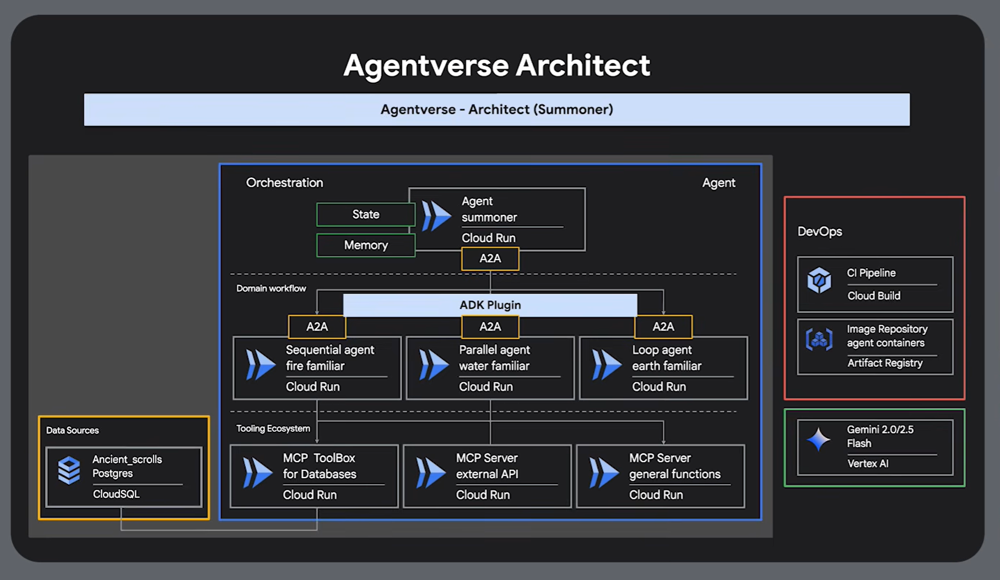
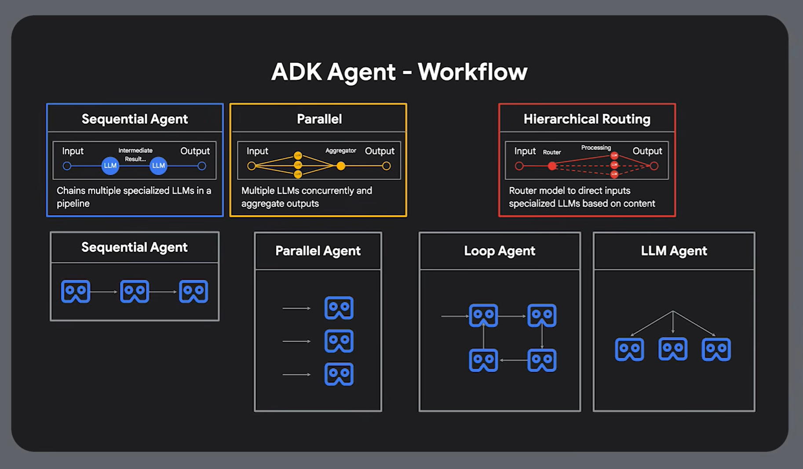
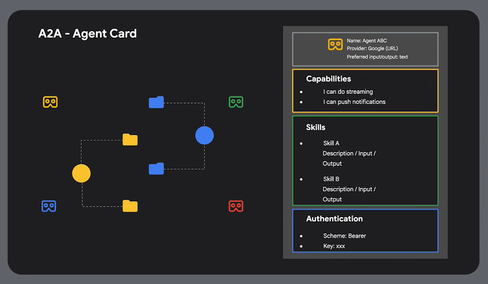
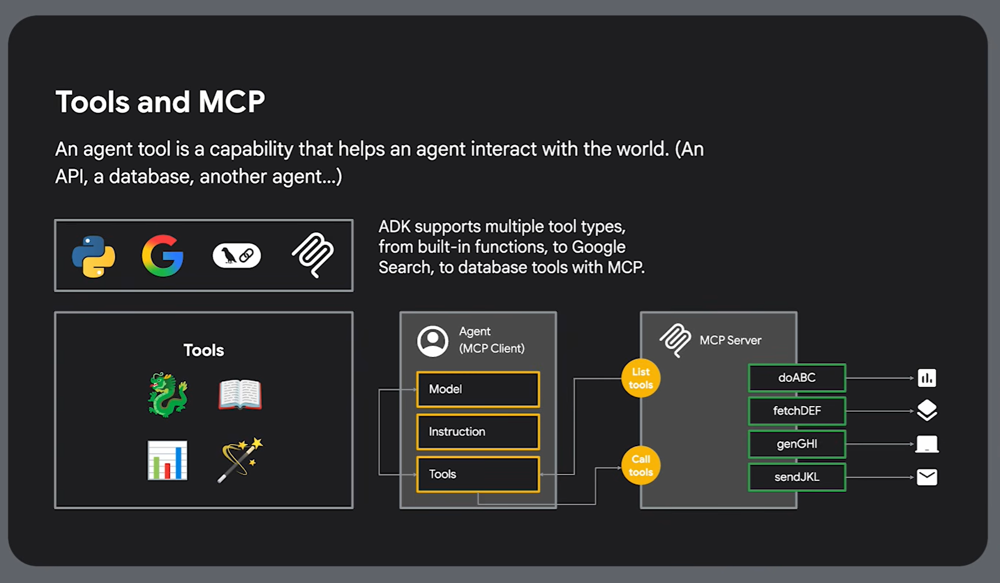
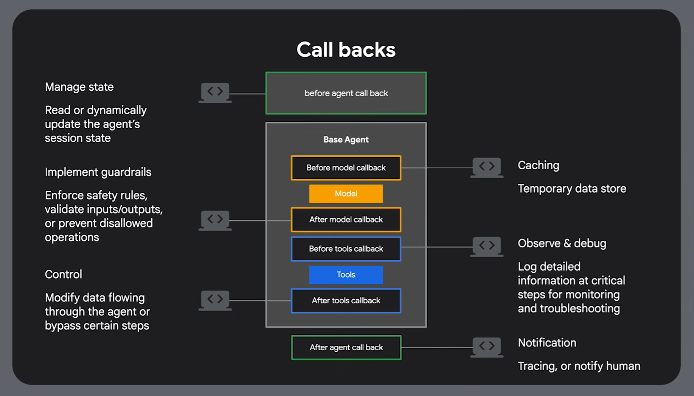

# Future Improvements & Architectural Roadmap

This document outlines the planned transition from our current monolithic RAG implementation to a more robust, agentic architecture.

---

## 1. Agentverse Architecture

**Explanation:** Transitioning from a single-script RAG system to a multi-agent "Agentverse" framework. This architecture allows specialized agents to collaborate, significantly improving the scalability and reliability of the property recommender.

---

## 2. ADK Agent Workflow

**Explanation:** Standardizing how agents process information using an Agent Development Kit (ADK). This workflow ensures that every request goes through a structured Plan-Execute-Verify cycle, reducing hallucinations and improving task completion rates.

---

## 3. Agent Identification (Agent Cards)

**Explanation:** Implementing "Agent Cards" to define clear roles, permissions, and toolsets for each agent. For example, a dedicated *Search Agent* will only have access to the vector database, while a *Analytics Agent* handles price trends and market data.

---

## 4. Standardized Integration (Tools & MCP)

**Explanation:** Utilizing the Model Context Protocol (MCP) to decouple our agents from the underlying data sources. This allows us to plug in new "Tools" (like external CRM data or mortgage calculators) without modifying the core agent logic.

---

## 5. Observability & Feedback Loops

**Explanation:** Introducing sophisticated callback mechanisms to monitor agent performance in real-time. This provides better debugging capabilities for developers and allows for "streaming" progress updates to the end-user.

---

## How to Improve Our Current Logic

Based on the architectural patterns above, here is how we will evolve the current `backend/app.py` logic:

1.  **From Monolith to Micro-Agents**: Currently, `app.py` handles routing, filtering, and RAG in one large file. We will break this down into a **Router Agent** (delegator) and **Service Agents** (Specialists).
2.  **Intent Detection vs. Routing**: Replace the hardcoded `_is_property_search` logic with a dynamic Agentverse-based routing system that can handle complex, multi-intent queries (e.g., "Find a villa in Zayed and compare its price to the market average").
3.  **Replace `exec()` with Native Tooling**: Our current `/recommend` endpoint generates Python code and uses `exec()`. We will move to a **Tool-Calling** paradigm where agents invoke predefined, safe functions to filter DataFrames, enhancing security and predictability.
4.  **Persistent Agent Memory**: Move beyond simple chat history to a persistent **Knowledge Graph** or memory layer that remembers user preferences across sessions more effectively than the current 3-turn extraction logic.
5.  **MCP-Driven Frontend**: Instead of the frontend calling specific endpoints like `/predict-price`, it will interact with a single **Agent Gateway** using MCP, allowing the backend to swap or update models/tools without requiring frontend changes.

---

## Video Resources & Inspiration

For a deeper dive into the world of agentic workflows and Agentverse concepts, refer to the following resources:

*   **Watch**: [Build a Multi-Agent System with ADK, MCP, and Gemini](https://youtu.be/2ERrxG-Ii3I?si=3zQfAaqqIqUoA4rH) — A comprehensive guide on the concepts that inspired this roadmap.
